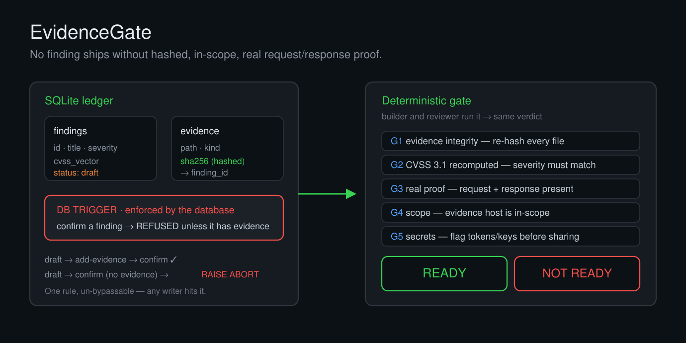

<p align="center">
  
</p>

<h1 align="center">EvidenceGate</h1>

<p align="center"><b>A security finding is only as good as the proof behind it.</b><br>
EvidenceGate is a tiny, dependency-free tool that won't let a finding be called
"confirmed" without hashed evidence — and re-verifies the whole package on the way out.</p>

<p align="center">
  
  
  
  
</p>

---

## The problem

Penetration-test and vulnerability-assessment reports fall apart in review for the same
boring reasons, over and over:

- a finding marked **confirmed** that has no capture behind it — just a memory of an error;
- a **CVSS score** typed by hand that the vector doesn't actually produce;
- a proof-of-concept **reconstructed from notes** instead of the real request and response;
- a screenshot from an **out-of-scope** host;
- a raw capture shipped to the client with a **live token or cookie** still in it.

Reviewers catch these one at a time, by hand, and builder and reviewer argue about whether
the package is "good enough." EvidenceGate turns that argument into a command.

## The idea

Two guarantees, one small tool:

1. **The ledger won't lie.** Findings and their evidence live in a SQLite database. A
   database trigger — not application code you can forget to call — refuses to move a
   finding to `confirmed` unless it has at least one hashed evidence row. The rule holds no
   matter what writes to the database.

2. **The gate is deterministic.** A single `gate` command re-hashes every file, recomputes
   every CVSS score, checks that each confirmed finding has a real request **and** response,
   confirms the evidence is in scope, and scans for leaked secrets. It prints one verdict:
   **READY** or **NOT READY**. The builder and the reviewer run the same command and get the
   same answer — so "is this ready to send?" stops being a matter of opinion.

## Install

No dependencies. Python 3.8+ and one file.

```bash
git clone https://github.com/abdullahzarshaid/evidencegate.git
cd evidencegate
python evidencegate.py --help
```

## Quickstart

```bash
python examples/quickstart.py
```

Or by hand:

```bash
# 1. start a ledger for the engagement
python evidencegate.py init assessment.db

# 2. record a finding (starts as a draft)
python evidencegate.py add-finding assessment.db --id F-01 \
    --title "IDOR on /account" --severity MEDIUM \
    --cvss "CVSS:3.1/AV:N/AC:L/PR:L/UI:N/S:U/C:H/I:N/A:N"

# 3. try to confirm it with no proof  ->  the database refuses
python evidencegate.py confirm assessment.db --id F-01
#   REFUSED: cannot confirm a finding with no evidence

# 4. attach the real capture (it is hashed on the way in), then confirm
python evidencegate.py add-evidence assessment.db --finding F-01 \
    --file proof/idor.txt --kind http
python evidencegate.py confirm assessment.db --id F-01
#   confirmed F-01

# 5. run the gate before you package anything
python evidencegate.py gate assessment.db --evidence-root . --in-scope example.test
```

A clean run ends with:

```
## VERDICT
READY
```

and a failing one tells you exactly why:

```
## VERDICT
NOT READY
- BLOCKER: G1 evidence integrity: 1 tampered
- BLOCKER: G2 CVSS defects: 1
```

## What the gate checks

| Gate | Check | Why it matters |
|------|-------|----------------|
| **G1** | Re-hash every evidence file against the value stored when it was attached | Detects a file that changed — or went missing — after it was recorded |
| **G2** | Recompute the CVSS 3.1 base score from the vector | A hand-typed severity that the vector doesn't support never ships |
| **G3** | Each confirmed finding has a capture containing a request line **and** a response status | A rejected attempt, a hunch, or a lone screenshot is not proof |
| **G4** | Evidence hosts are inside the declared scope *(optional, `--in-scope`)* | Out-of-scope evidence is caught before the client sees it |
| **G5** | Scan evidence for JWTs, bearer tokens, AWS keys and private keys | Live secrets get flagged for redaction before sharing |

Exit code is `0` for READY and `1` for NOT READY, so it drops straight into CI or a
pre-delivery hook.

## Design notes

- **Standard library only.** `sqlite3`, `hashlib`, `re`, `argparse`. Nothing to install,
  nothing phoning home, no network access.
- **The CVSS 3.1 math is the published FIRST specification**, verified against the
  specification's own worked examples in the test suite.
- **Evidence lives on disk; the ledger stores paths and hashes.** Point `--evidence-root`
  at the directory that holds only your captures.
- **It refuses; it never rewrites.** EvidenceGate blocks a bad package. Fixing the finding,
  the score or the redaction stays a human decision.

## Tests

```bash
python test_evidencegate.py        # or: python -m pytest -q
```

Ten tests cover the CVSS math, the database trigger, and every gate.

## Scope and intent

Built for practitioners running **authorized** security assessments who want their findings
to survive scrutiny. It verifies the discipline of a report; it does not attack anything.

## License

[MIT](LICENSE) © Abdullah Bin Zarshaid. Use it, fork it, build on it. If it saved you a
review cycle, a ⭐ helps others find it.
