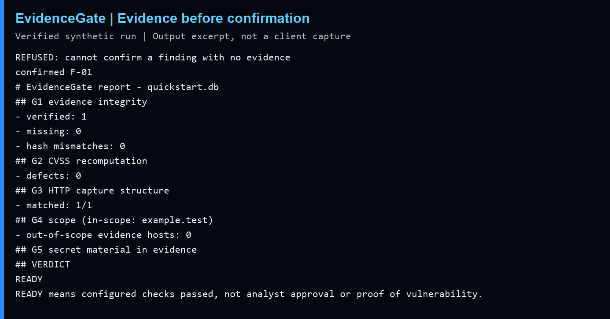

# See evidence-presence checks in action

**Problem:** a finding should not be marked confirmed without a supporting evidence reference.

**Run:** `python examples/quickstart.py` (Python 3.10+, standard library only).

**Result:** confirmation is first rejected. The demo attaches a fictional HTTP request/response, records confirmation, then runs the configured gate. Expected exit codes are checked. The SQLite ledger exists only in a temporary directory and is removed when the demo finishes. No target is contacted.

The image is typeset from a verified run transcript, with local paths normalized. It is not a client assessment screenshot. The example capture is invented, not captured from a service.

**Interpretation:** the gate checks evidence packaging. A READY result does not prove the IDOR claim, authorization, complete redaction or analyst approval. A real access-control finding needs an ownership/permission expectation, controlled comparisons, the relevant request and response, and an impact assessment.
